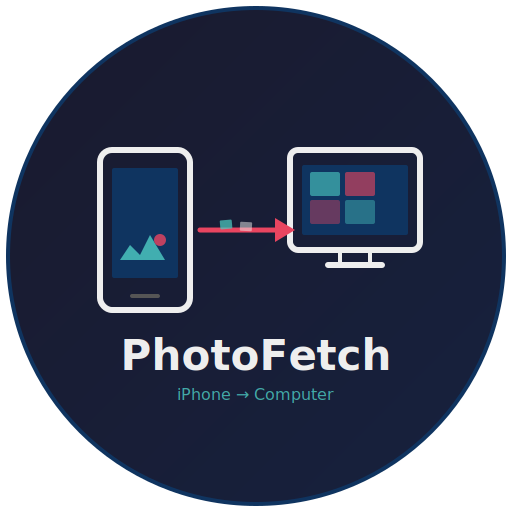

# PhotoFetch

<p align="center">
  
</p>

**The simplest way to get photos off your iPhone onto your computer.** One click. No cloud subscriptions. No iTunes library nonsense. Just your photos, in a folder, where you want them.

## Why PhotoFetch?

### Windows
Windows has no good way to import all your iPhone photos to a regular folder. Your options today:
- **File Explorer** — manually browse DCIM folders, copy-paste hundreds of cryptic subfolders
- **Windows Photos app** — imports into its own library format, not normal files
- **iTunes** — syncs, doesn't export. Confusing and bloated.

**PhotoFetch:** One click → all photos land in `D:\Photos\iPhone` as normal JPG/HEIC/MOV files. Run it again next month → only new photos are copied.

### Linux
Connecting an iPhone on Linux is painful:
- `ifuse` breaks regularly with iOS updates
- No official Apple support for Linux at all
- Most users give up and email photos to themselves

**PhotoFetch:** Works without `ifuse`. Talks directly to the iPhone over USB using its own AFC protocol implementation. Just plug in and click.

### macOS
macOS has decent built-in tools (Image Capture, Photos app), but:
- **Image Capture** re-imports everything every time — no "sync only new" option
- **Photos app** locks files in its library — you don't get normal files in a folder
- **AirDrop** — one photo at a time, doesn't scale to thousands

**PhotoFetch:** Smart sync to any folder. External drives work. Run it weekly — only new photos are copied each time.

## Features

- **One-click backup** — big "Copy all photos" button, no configuration needed
- **Smart sync** — automatically skips files already downloaded (compares filename + size)
- **Save anywhere** — internal drive, external USB drive, NAS, wherever you want
- **USB Transfer** — connect via cable, no internet needed, works offline
- **iCloud Transfer** — authenticate with Apple ID, access full library remotely
- **Live progress** — transfer speed, ETA, cancel button, non-blocking
- **Browse & select** — grid/list views, date filtering, lightbox with zoom
- **GPS map** — see where each photo was taken
- **Remembers settings** — last folder saved, no repetitive setup
- **27 languages** — auto-detects your system language

## Install

### macOS
1. Download `PhotoFetch.dmg` from [Releases](../../releases)
2. Open Terminal: `xattr -cr ~/Downloads/PhotoFetch.dmg`
3. Open the DMG, drag to Applications
4. First launch: right-click → Open

### Windows
1. Download `PhotoFetch.exe` from [Releases](../../releases)
2. Run it — opens a native window automatically
3. iTunes must be installed (provides the Apple USB driver)

### Linux
1. Install dependencies: `sudo apt install usbmuxd python3-gi gir1.2-webkit2-4.1`
2. Download and run from source (see below)

## Run from source (all platforms)

```bash
git clone https://github.com/PhotoFetch/PhotoFetch.git
cd PhotoFetch
python3 -m venv .venv
source .venv/bin/activate  # Linux/macOS
# .venv\Scripts\activate   # Windows
pip install -e .
python -m photofetch
```

Opens a native window automatically.

## Requirements (from source)

- Python 3.10+
- ffmpeg (optional, for video thumbnails)
- iPhone trusted to this computer ("Trust This Computer?" prompt)
- USB driver: iTunes on Windows, usbmuxd on Linux (macOS has it built in)
- Apple ID with 2FA (for iCloud mode)

## Build

```bash
./build.sh
```

Produces a standalone binary via Nuitka. CI workflow builds for all platforms on tag push.

## Troubleshooting

### "Device not paired" / "Trust the device first"

Even if your iPhone shows up in File Explorer (Windows) or Finder (macOS), PhotoFetch uses a different protocol (AFC) that requires its own trust pairing.

**Fix:**
1. Disconnect the iPhone
2. On the iPhone: **Settings → General → Transfer or Reset iPhone → Reset → Reset Location & Privacy**
3. Reconnect the USB cable
4. Tap **Trust** when prompted (iPhone must be unlocked)
5. Wait a few seconds, then relaunch PhotoFetch

**If the Trust dialog doesn't appear:**
- Try a different USB cable or port
- Make sure the iPhone screen is unlocked when connecting
- Windows: restart Apple Mobile Device Service (`net stop "Apple Mobile Device Service"` then `net start`)
- macOS: restart usbmuxd (`sudo killall usbmuxd` — it auto-restarts)
- Linux: ensure usbmuxd is running (`sudo systemctl start usbmuxd`)

### "No device found"

PhotoFetch can't see the iPhone at all.

- **Windows:** iTunes must be installed (provides the Apple USB driver). Verify: open iTunes and check if it sees your iPhone.
- **Linux:** Install and start usbmuxd: `sudo apt install usbmuxd && sudo systemctl start usbmuxd`
- **macOS:** Should work out of the box. If not, try a different USB-C/Lightning cable — some cheap cables are charge-only.
- **All platforms:** Try a different USB port (preferably directly on the motherboard, not a hub).

### "Permission denied" when saving

PhotoFetch can't write to the selected folder.

- Make sure you own the folder or have write permissions
- Avoid system-protected paths (e.g. `C:\Program Files`, `/usr/local`)
- On macOS: grant Full Disk Access to your terminal/browser if saving to external drives

### iCloud: 2FA code not arriving or timing out

- Make sure you're entering the 6-digit code from a **trusted device**, not SMS (SMS can be delayed)
- The code expires quickly — enter it within 30 seconds of receiving it
- If stuck, cancel and try logging in again — Apple will send a fresh code

## Architecture

```
Native Window (pywebview) ←→ Flask API ←→ USB Service ←→ AFC Protocol ←→ iPhone
                                       ←→ iCloud Service ←→ pyicloud ←→ Apple servers
```

- **Direct-to-folder download** with Server-Sent Events for real-time progress
- **Persistent AFC connection** reused across batch (no per-file reconnect overhead)
- **CSRF protection** via Origin header validation
- **Cross-platform folder picker** — native OS dialog (osascript / PowerShell / zenity / tkinter)

The USB communication uses a custom MIT-licensed implementation of:
- usbmuxd client (device discovery, TCP tunneling)
- lockdown protocol (TLS session establishment)
- AFC binary protocol (file listing, stat, read)

## Tests

```bash
pip install -e ".[dev]"
pytest -v
```

## License

GPL-3.0-or-later — © 2026 Botond Bako. See [LICENSE](LICENSE).
